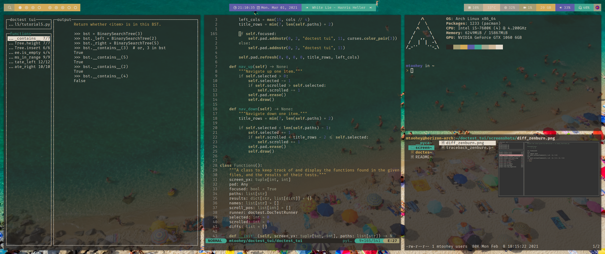

# dotfiles

My cross-platform (MacOS and Linux) dotfiles.



## Usage

If you want to make use of these yourself, just clone the repository with:

```bash
git clone https://github.com/mtoohey31/dotfiles/
```

...then copy everything to where it needs to go.

There are quite a few dependencies so if something is behaving unexpectedly, try taking a look at the script/config file in question, it's likely that a program it depends on is missing.

If you would like to also keep your dotfiles in GitHub so that you have them backed up, create your own fork of the repository on GitHub, then clone the repository with the following commands instead. Please be aware that running these two commands will overwrite any current configs that overlap with mine, so you should back your stuff up first:

```bash
git clone --bare https://github.com/{YOUR_USERNAME}/dotfiles/ .dotfiles
git --git-dir=$HOME/.dotfiles --work-tree=$HOME reset --hard
```

...then whenever you need to push a change, use git as you normally would, except replace the `git` part of your commands with `dot` and it will set the git directory and work tree options automatically with one of my fish aliases.
